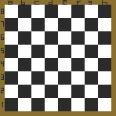

# Ajedrezproyecto
tarea de programacion 2, Ajedrez que comprueba si el rey se encuentra en jaque, Oziel Rodman Ramos Torrez

Este es un programa de java, y el archivo Main se encuentra en:
\src\ches\Main.java
para ejecutar el programa se debe colocar los dos siguientes comandos en el git bash:

javac -d bin src/ches/*.java
java -cp bin ches.Main

